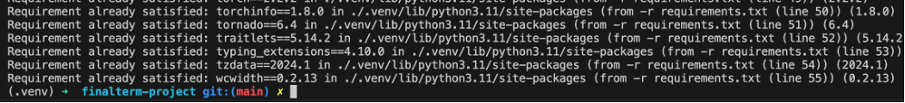
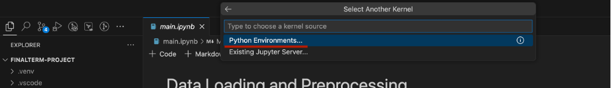
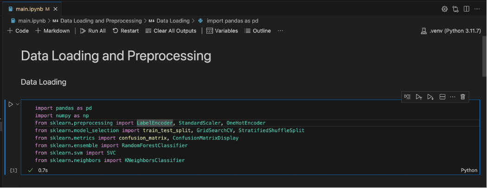

# Dry beans classification problem

This repository implements and compares 4 different machine learning algorithms to classify different dry beans.

1. Random Forest
2. SVM
3. KNN
4. Conv1D Deep Learning

Dataset can be found [here](https://archive.ics.uci.edu/dataset/602/dry+bean+dataset)

## Local setup

### Python configuration

python==3.11.7

### Python package configuration

See requirements.txt file

### Steps to setup project locally

1. Make sure that you have correct python version installed. It may not work, if python version is different.

2. Create a virtual environtment using `python3 -m venv .venv`

3. Activate the virtaul environment using `source .venv/bin/activate`

4. Install all the packages in **requirements.txt** using `pip install -r requirements.txt`

5. Select existing `.venv` python environment as the kernel for the `main.ipynb` Jupyter notebook.

6. Run cells in `main.ipynb` jupyter notebook

